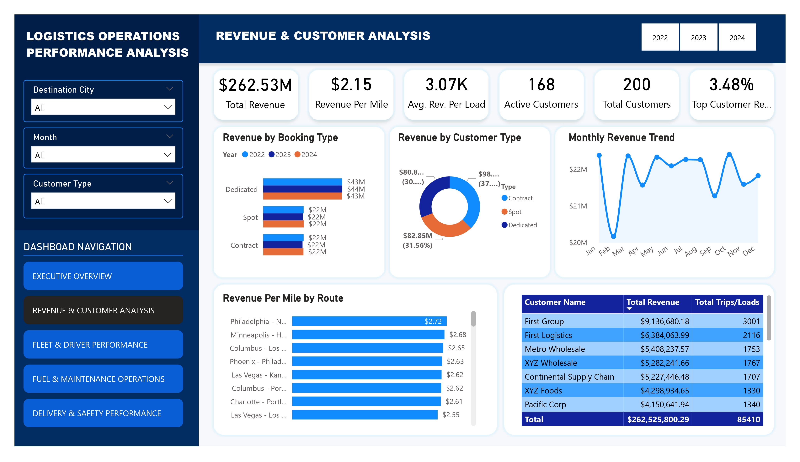
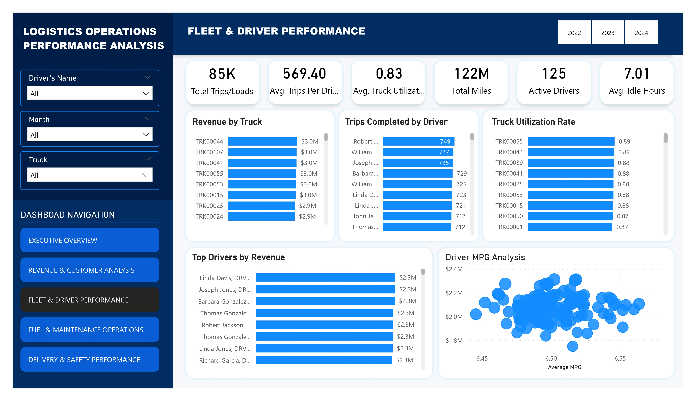
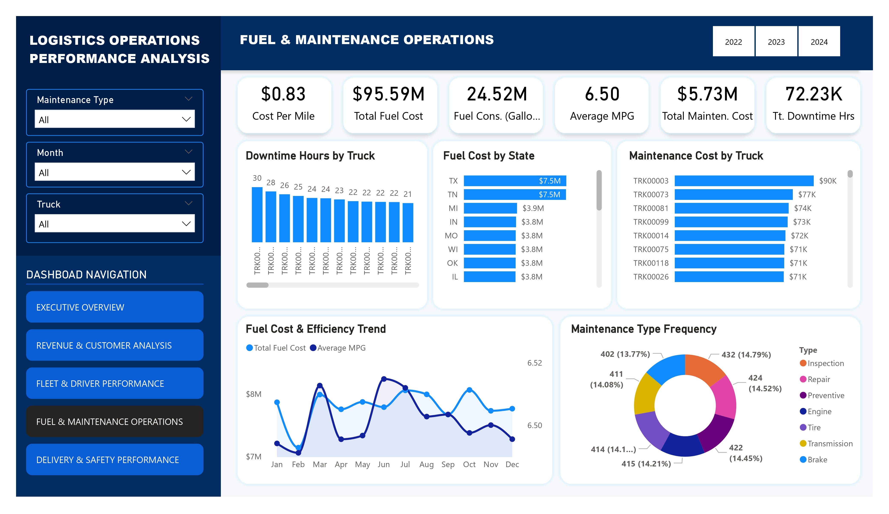
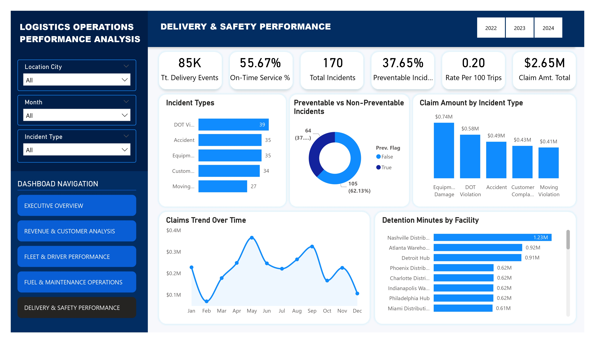

# 🚛 Logistics Operations Performance Analysis Dashboard
Interactive Power BI dashboard analyzing logistics operations, fleet performance, fuel efficiency, maintenance operations, customer revenue trends, and safety analytics.

## 📌 Project Overview
This project is a comprehensive Business Intelligence solution developed as the Capstone Project for my Data Analytics training at Tech Sphere Academy.

The project focuses on transforming raw logistics operational data into meaningful business insights using Microsoft Power BI. The dashboard provides interactive analysis of logistics performance across revenue operations, fleet management, fuel consumption, maintenance activities, delivery performance, and safety operations.

The objective of the project was to build an executive-level dashboard capable of supporting operational monitoring and strategic decision-making within a logistics environment.

## 🎯 Business Problem
Logistics organizations generate large volumes of operational data daily across transportation, customer management, fuel operations, maintenance activities, and delivery execution.

Without centralized analytics, it becomes difficult to:

Monitor operational efficiency
Identify revenue-driving customers and routes
Track fleet performance
Analyze operational costs
Evaluate delivery reliability
Monitor safety and incident trends

This project addresses these challenges by developing an interactive dashboard that consolidates key operational metrics into a single analytical solution.

## 📂 Dataset Description
The dataset contains 14 interconnected logistics operational tables, including:

Drivers
Trucks
Trailers
Customers
Facilities
Routes
Loads
Trips
Fuel Purchases
Maintenance Records
Delivery Events
Safety Incidents
Driver Monthly Metrics
Truck Utilization Metrics

The dataset spans operational activities from:
📅 2022 – 2024

## 🛠️ Tools and Technologies Used
| Tool          | Purpose                  |
| ------------- | ------------------------ |
| Excel         | Initial data storage     |
| Power BI      | Dashboard development    |
| Power Query   | Data transformation      |
| DAX           | KPI and measure creation |
| Data Modeling | Relationship management  |

---

## 📊 Dashboard Structure
The dashboard was divided into 5 major analytical sections:

### 1️⃣ Executive Overview
Provides high-level operational KPIs and overall business performance insights.
#### Key Metrics:
Total Revenue
Total Trips/Loads
Average MPG
Fuel Cost
Total Incidents
Service Punctuality
#### Key Visuals:
Revenue Trend Over Time
Top Customers by Revenue
Top Drivers by Revenue
Revenue by Route

### 2️⃣ Revenue & Customer Analysis
Focused on revenue generation and customer contribution analysis.
#### Key Metrics:
Revenue per Mile
Average Revenue per Load
Active Customers
Top Customer Revenue Contribution %
#### Key Visuals:
Revenue by Booking Type
Revenue by Customer Type
Monthly Revenue Trend
Revenue per Mile by Route
Customer Performance Table

### 3️⃣ Fleet & Driver Performance
Analyzed operational productivity and fleet efficiency.
#### Key Metrics:
Total Trips Completed
Average Trips per Driver
Fleet MPG
Truck Utilization Rate
Total Distance Covered
Average Idle Time
#### Key Visuals:
Top Drivers by Revenue
Revenue by Truck
Driver MPG Analysis
Truck Utilization Trends

### 4️⃣ Fuel & Maintenance Operations
Focused on operational cost and fleet maintenance analysis.
#### Key Metrics:
Total Fuel Consumption
Total Fuel Cost
Cost per Mile
Maintenance Cost
Maintenance Events
Downtime Hours
#### Key Visuals:
Fuel Efficiency Trend
Maintenance Cost by Truck
Fuel Cost Analysis
Maintenance Operations Trend

### 5️⃣ Delivery & Safety Performance
Analyzed delivery reliability and operational safety.
#### Key Metrics:
On-Time Delivery %
Preventable Incidents %
Safety Incident Rate
Claim Amount Total
Late Deliveries %
#### Key Visuals:
Incident Trend Analysis
Safety Incident Breakdown
Delivery Performance Trends
Claim Cost Analysis

---

## 🧠 Key Insights Generated
### 📌 Revenue Insights
A small group of customers contributed a significant percentage of total revenue.
Certain logistics routes generated substantially higher revenue per mile.
### 📌 Operational Insights
Truck utilization rates varied significantly across the fleet.
Some drivers consistently contributed higher operational revenue.
### 📌 Cost Insights
Fuel costs represented a major portion of operational expenses.
Cost-per-mile analysis highlighted operational efficiency differences across routes.
### 📌 Safety Insights
Preventable incidents contributed significantly to total safety incidents.
Claim amounts revealed the financial impact of operational safety failures.

## 🔍 Data Preparation & Modeling
The project involved:
Building relationships across operational tables
Creating a centralized Date Table
Developing DAX measures for KPI calculations
Creating interactive slicers and navigation
Optimizing dashboard storytelling and layout

## 📈 Skills Demonstrated
### Technical Skills
Power BI Dashboard Development
DAX Calculations
Power Query Transformations
Data Modeling
KPI Development
Interactive Reporting
### Analytical Skills
Business Intelligence
Operational Analytics
Trend Analysis
Performance Monitoring
Executive Reporting
Dashboard Storytelling

---

## 📷 Dashboard Preview

---

## 🚀 Project Outcome

The project successfully transformed raw logistics operational data into an interactive analytics solution capable of supporting:

Executive decision-making
Operational monitoring
Cost optimization
Fleet performance analysis
Safety performance evaluation

---

## 🎓 Acknowledgement

This capstone project was completed as part of my Data Analytics training at Tech Sphere Academy.

Special appreciation to my tutor, Mr. Ezekiel Aleke, for his guidance and support throughout the learning journey.

---

## 👨‍💻 About Me
### David Edeh

Data Analytics Enthusiast | Power BI Developer | Graphic Designer | Video Editor

Passionate about using data, creativity, and technology to solve real-world problems and create meaningful impact.

---

## 🔗 Connect With Me
### LinkedIn:

www.linkedin.com/in/david-edeh-84aa65232
### GitHub:

(Insert your GitHub profile link)
