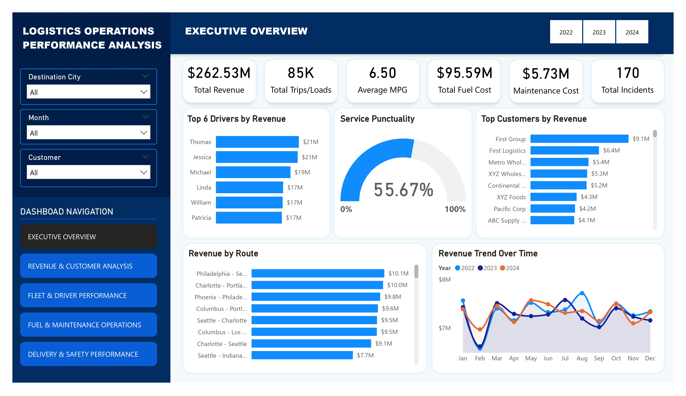

# Logistics Operations Performance Analysis Dashboard
Interactive Power BI dashboard analyzing logistics operations, fleet performance, fuel efficiency, maintenance operations, customer revenue trends, and safety analytics.

# Project Overview
This project is a comprehensive Business Intelligence solution developed as the Capstone Project for my Data Analytics training at Tech Sphere Academy.

The project focuses on transforming raw logistics operational data into meaningful business insights using Microsoft Power BI. The dashboard provides interactive analysis of logistics performance across revenue operations, fleet management, fuel consumption, maintenance activities, delivery performance, and safety operations.

The objective of the project was to build an executive-level dashboard capable of supporting operational monitoring and strategic decision-making within a logistics environment.
